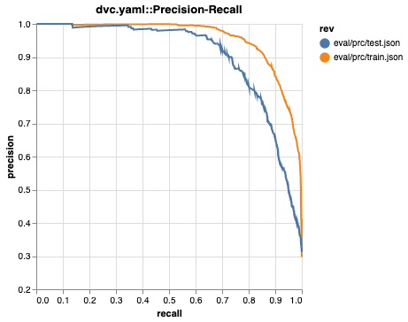
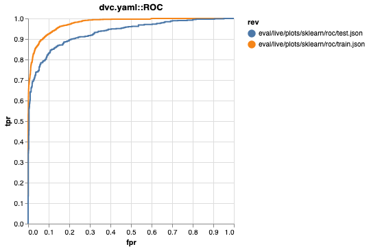
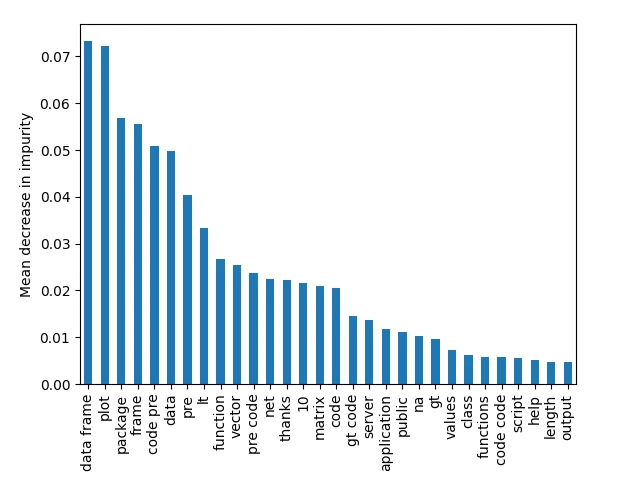
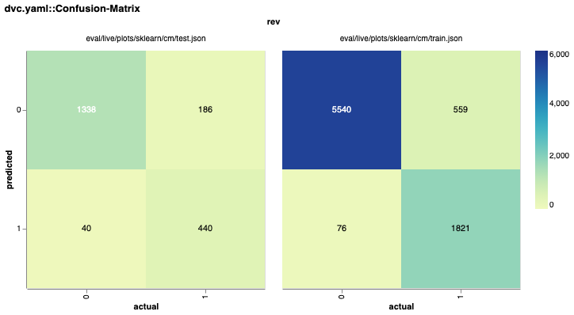

# Get Started: Data Management

- [Data Versioning](#data-versioning)

  - [Tracking Data](#tracking-data)
  - [Storing and Sharing](#storing-and-sharing)
    - [Configure a remote](#configure-a-remote)
    - [Uploading data](#uploading-data)
    - [Retrieving data](#retrieving-data)
  - [Making Local Changes](#making-local-changes)
  - [Switching between Versions](#switching-between-versions)
    - [Returning to a previous version of the dataset](#returning-to-a-previous-version-of-the-dataset)

- [Data Pipelines](#data-pipelines)

  - [Setup](#setup)
  - [Pipeline Stages](#pipeline-stages)
  - [Dependency Graphs](#dependency-graphs)
  - [Reproducing](#reproducing)
    - [Learn how to parametrize and use cached results](#learn-how-to-parametrize-and-use-cached-results)
  - [Visualizing](#visualizing)

- [Metrics, Parameters and Plots](#metrics-parameters-and-plots)
  - [Collecting Metrics and Plots](#collecting-metrics-and-plots)
    - [How to customize metrics and plots](#how-to-customize-metrics-and-plots)
  - [Viewing Metrics and Plots](#viewing-metrics-and-plots)

## Data Versioning <a id="data-versioning"></a>

### Tracking Data <a id="tracking-data"></a>

First, get the data:

```bash
dvc get https://github.com/iterative/dataset-registry \
    get-started/data.xml -o data/data.xml
```

Use `dvc add` to start tracking the dataset file:

```bash
dvc add data/data.xml
```

Next, run the following commands to track changes in Git:

```bash
git add data/data.xml.dvc data/.gitignore
git commit -m "Add raw data"
```

Now the metadata about your data is versioned (inside `data/data.xml.dvc`) alongside your source code, while the original data file was added to `.gitignore`

### Storing and Sharing <a id="storing-and-sharing"></a>

#### Configure a remote <a id="configure-a-remote"></a>

Before pushing data to a remote we need to set it up using the `dvc remote add` command:

```bash
mkdir /tmp/dvcstore
dvc remote add -d storage /tmp/dvcstore
```

Or you can link to your Google Drive:

```bash
dvc remote add -d storage gdrive://<base>/path/to/folder
dvc remote modify storage gdrive_acknowledge_abuse true
```

Refer [here](https://dvc.org/doc/user-guide/data-management/remote-storage) for more information on remote storage options.

#### Uploading data <a id="uploading-data"></a>

Now that a storage remote was configured, run `dvc push` to upload data:

```bash
dvc push
```

Usually, we would also want to Git track any code changes that led to the data change:

```bash
git add .
git commit -m "Configure remote storage"
git push
```

#### Retrieving data <a id="retrieving-data"></a>

Run the following code first to simulate a "fresh" pull:

```bash
rm -rf .dvc/cache  # dvc is smart about storing and versioning data
rm -f data/data.xml
```

Once DVC-tracked data and models are stored remotely, they can be downloaded with `dvc pull` when needed (e.g. in other copies of this project). Usually, we run it after `git pull` or `git clone`.

```bash
dvc pull
```

### Making Local Changes <a id="making-local-changes"></a>

Next, let's say we obtained more data from some external source. We will simulate this by doubling the dataset contents:

```bash
cp data/data.xml /tmp/data.xml  # copy/duplicate the data
cat /tmp/data.xml >> data/data.xml  # concatenate the data to double the size and content
```

After modifying the data, run `dvc add` again to track the latest version:

```bash
dvc add data/data.xml
```

Now we can run `dvc push` to upload the changes to the remote storage, followed by a `git commit` to track them:

```bash
dvc push
git commit data/data.xml.dvc -m "Dataset updated"
```

### Switching between Versions <a id="switching-between-versions"></a>

A commonly used workflow is to use `git checkout` to switch to a branch or checkout a specific `.dvc` file revision, followed by a `dvc checkout` to sync data into your workspace:

```bash
git checkout <...>
dvc checkout
```

#### Returning to a previous version of the dataset <a id="returning-to-a-previous-version-of-the-dataset"></a>

Let's go back to the original version of the data:

```bash
git checkout HEAD~1 data/data.xml.dvc
dvc checkout
```

Let's commit it (no need to do `dvc push` this time since this original version of the dataset was already saved):

```bash
git commit data/data.xml.dvc -m "Revert dataset updates"
```

## Data Pipelines <a id="data-pipelines"></a>

### Setup <a id="setup"></a>

```bash
wget https://code.dvc.org/get-started/code.zip
unzip code.zip && rm -f code.zip
```

Inspect project structure:

```bash
tree
.
├── README.md
├── data
│   ├── data.xml  # your data tracked by dvc not by git
│   └── data.xml.dvc  # git tracks this which points to the real data
├── params.yaml
└── src
    ├── evaluate.py
    ├── featurization.py
    ├── prepare.py
    ├── requirements.txt
    └── train.py
```

Now, let's go through some usual project setup steps (`virtualenv`, `requirements.txt`, Git).

First, create and use a virtual environment (it's not a must, but we strongly recommend it):

```bash
conda create -n your_env_name python=3.11 -y
conda activate your_env_name
pip install -r src/requirements.txt  # install Python requirements
touch .gitignore  # create a .gitignore
git add .github/ data/ params.yaml src .gitignore
git commit -m "Initial commit"
```

### Pipeline Stages <a id="pipeline-stages"></a>

Use `dvc stage add` to create stages. These represent processing steps (usually scripts/code tracked with Git) and combine to form the pipeline. Stages allow connecting code to its corresponding data input and output. Let's transform a Python script into a stage:

```bash
dvc stage add -n prepare \  # name of the stage
            -p prepare.split,prepare.seed \  # parameters the stage requires
            -d src/prepare.py -d data/data.xml \  # files and data the stage depends on
            -o data/prepared \  # output of the stage
            python src/prepare.py data/data.xml  # command to run
```

A [`dvc.yaml`](dvc.yaml) file is generated. It includes information about the command we want to run (`python src/prepare.py data/data.xml`), its dependencies, and outputs.

### Dependency Graphs <a id="dependency-graphs"></a>

By using `dvc stage add` multiple times, defining outputs of a stage as dependencies of another, we can describe a sequence of dependent commands which gets to some desired result. This is what we call a dependency graph which forms a full cohesive pipeline.

Let's create a 2nd stage chained to the outputs of prepare, to perform feature extraction:

```bash
dvc stage add -n featurize \
            -p featurize.max_features,featurize.ngrams \
            -d src/featurization.py -d data/prepared \
            -o data/features \
            python src/featurization.py data/prepared data/features
```

The [`dvc.yaml`](dvc.yaml) file will now be updated to include the two stages.

And finally, let's add a 3rd train stage:

```bash
dvc stage add -n train \
            -p train.seed,train.n_est,train.min_split \
            -d src/train.py -d data/features \
            -o model.pkl
            python src/train.py data/features model.pkl
```

Finally, our [`dvc.yaml`](dvc.yaml) should have all 3 stages.

This would be a good time to commit the changes with Git. These include .`gitignore`(s) and [`dvc.yaml`](dvc.yaml) — which describes our pipeline.

```bash
git add .gitignore data/.gitignore dvc.yaml
git commit -m "Defined pipeline"
```

Great! Now we're ready to run the pipeline.

### Reproducing <a id="reproducing"></a>

The pipeline definition in [`dvc.yaml`](dvc.yaml) allow us to easily reproduce the pipeline:

```bash
dvc repro
```

You'll notice a [`dvc.lock`](dvc.lock) (a "state file") was created to capture the reproduction's results.

The [`dvc.lock`](dvc.lock) file is similar to a `.dvc` file — it captures hashes (in most cases `md5s`) of the dependencies and values of the parameters that were used. It can be considered a state of the pipeline.

It's good practice to immediately commit [`dvc.lock`](dvc.lock) to Git after its creation or modification, to record the current state & results:

```bash
git add dvc.lock && git commit -m "First pipeline repro"
```

#### Learn how to parametrize and use cached results <a id="learn-how-to-parametrize-and-use-cached-results"></a>

Let's try to have a little bit of fun with it. First, change one of the parameters for the training stage:

1. Open [`params.yaml`](params.yaml) and change `n_est` to 100, and
2. (re)run `dvc repro`.

You will see:

```bash
dvc repro

Stage 'prepare' didn't change, skipping
Stage 'featurize' didn't change, skipping
Running stage 'train' with command: ...
```

DVC detected that only train should be run, and skipped everything else! All the intermediate results are being reused.

Now, let's change it back to 50 and run dvc repro again:

```bash
dvc repro

Stage 'prepare' didn't change, skipping
Stage 'featurize' didn't change, skipping
```

As before, there was no need to rerun prepare, featurize, etc. But this time it also doesn't rerun train! The previous run with the same set of inputs (parameters & data) was saved in DVC's run cache, and was reused.

### Visualizing <a id="visualizing"></a>

Having built our pipeline, we need a good way to understand its structure. Visualizing it as a graph of connected stages helps with that. DVC lets you do so without leaving the terminal!

```bash
dvc dag
         +---------+
         | prepare |
         +---------+
              *
              *
              *
        +-----------+
        | featurize |
        +-----------+
              *
              *
              *
          +-------+
          | train |
          +-------+
```

## Metrics, Parameters and Plots <a id="metrics-parameters-and-plots"></a>

### Collecting Metrics and Plots <a id="collecting-metrics-and-plots"></a>

First, let's see the mechanism to capture values for these ML attributes. Add a final evaluation stage to our earlier pipeline:

```bash
dvc stage add -n evaluate \
            -d src/evaluate.py -d data/features -d model.pkl \
            -o eval \
            python src/evaluate.py model.pkl data/features
```

`dvc stage add` will generates this new stage in the [`dvc.yaml`](dvc.yaml) file:

```yaml
evaluate:
  cmd: python src/evaluate.py model.pkl data/features
  deps:
    - data/features
    - model.pkl
    - src/evaluate.py
  outs:
    - eval
```

#### How to customize metrics and plots <a id="how-to-customize-metrics-and-plots"></a>

To combine train and test data, and to set other custom attributes like titles, we add the following to [`dvc.yaml`](dvc.yaml):

```yaml
metrics:
  - eval/metrics.json
plots:
  - ROC:
      template: simple
      x: fpr
      y:
        eval/plots/sklearn/roc/train.json: tpr
        eval/plots/sklearn/roc/test.json: tpr
  - Confusion-Matrix:
      template: confusion
      x: actual
      y:
        eval/plots/sklearn/cm/train.json: predicted
        eval/plots/sklearn/cm/test.json: predicted
  - Precision-Recall:
      template: simple
      x: recall
      y:
        eval/prc/train.json: precision
        eval/prc/test.json: precision
  - eval/importance.png
```

Let's run and save these changes:

```bash
dvc repro

Stage 'prepare' didn't change, skipping
Stage 'featurize' didn't change, skipping
Stage 'train' didn't change, skipping
Running stage 'evaluate' with command: ...
```

```bash
git add .gitignore dvc.yaml dvc.lock eval
git commit -a -m "Create evaluation stage"
```

### Viewing Metrics and Plots <a id="viewing-metrics-and-plots"></a>

You can view metrics and plots from the command line, or you can load your project in VS Code and use the [DVC Extension](https://marketplace.visualstudio.com/items?itemName=Iterative.dvc) to view metrics, plots, and more.

You can view tracked metrics with `dvc metrics show`:

```bash
dvc metrics show
Path                    avg_prec.test    avg_prec.train    roc_auc.test    roc_auc.train
eval/metrics.json  0.94496          0.97723           0.96191         0.98737
```

You can view plots with `dvc plots show` (shown below), which generates an HTML file you can open in a browser.

```bash
dvc plots show
file:///Users/dvc/example-get-started/dvc_plots/index.html
```








